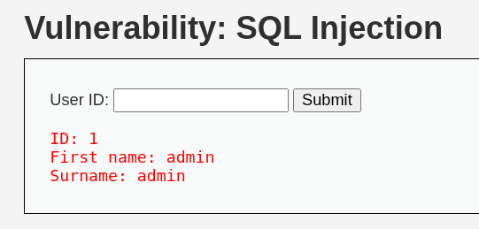
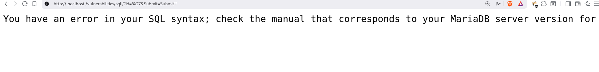

# Objective
The Objective is to find SQLi (SQL injection) in DVWA at different level

### level: `low`

- As we can see give an id number and get user info like first and surname but we know its `vulnerable` as its written on top of it.
- This is the easiest level as a simple `'` give away the fact that DVWA using `MariaDB` in the backend.

- Now lets tweak it a little and check `order by` which gave me error at 3 so its `2`, we need to pass two 
- 
### level: `medium`

### level: `high`