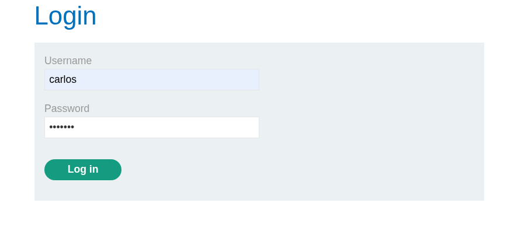
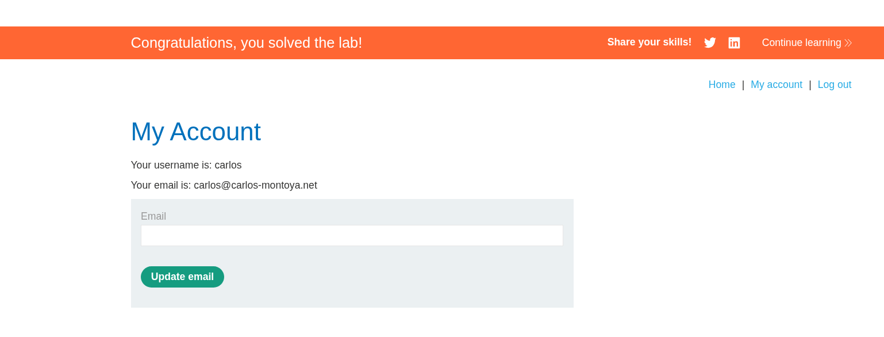

# Authentication - 2FA Simple Bypass

## Lab Description

This lab contains a flawed two-factor authentication (2FA) implementation.

The goal is to access Carlos's account without possessing his 2FA verification code.

### Credentials

**Attacker Account**

```text
Username: wiener
Password: peter
```

**Victim Account**

```text
Username: carlos
Password: montoya
```

### Objective

Access Carlos's account page.

---

## Reconnaissance

The application requires a username, password, and a 4-digit verification code during the login process.

Using Carlos's credentials:

```text
carlos:montoya
```

successfully authenticated the username and password, but the application then requested a 4-digit security code.

Since the verification code was unknown, direct login was not possible.

---

## Exploitation

After submitting Carlos's username and password, I was redirected to the 2FA verification page.

Instead of providing a valid verification code, I clicked **"Back to Home"** and then navigated to **"My Account"**.

Unexpectedly, the application granted access to Carlos's account without validating the 2FA code.

### Screenshot






---

## Root Cause

The application correctly verified the username and password but failed to enforce completion of the second authentication factor.

The server treated the user as fully authenticated immediately after password verification, even though the 2FA step had not been completed.

As a result, an attacker could bypass the 2FA mechanism simply by navigating directly to authenticated pages.

---

## Impact

A vulnerability like this completely defeats the purpose of two-factor authentication.

An attacker who obtains valid credentials can:

* Access protected accounts
* Bypass additional authentication controls
* Perform actions as the victim user
* Compromise sensitive information

---

## Key Takeaways

* Authentication should not be considered complete until all required factors are successfully verified.
* Sensitive pages should validate that the 2FA process has been completed.
* Session state must clearly distinguish between:

  * Password authenticated
  * Fully authenticated (password + 2FA)

---

## Vulnerability

**Authentication Bypass via Incomplete Two-Factor Authentication Enforcement**

