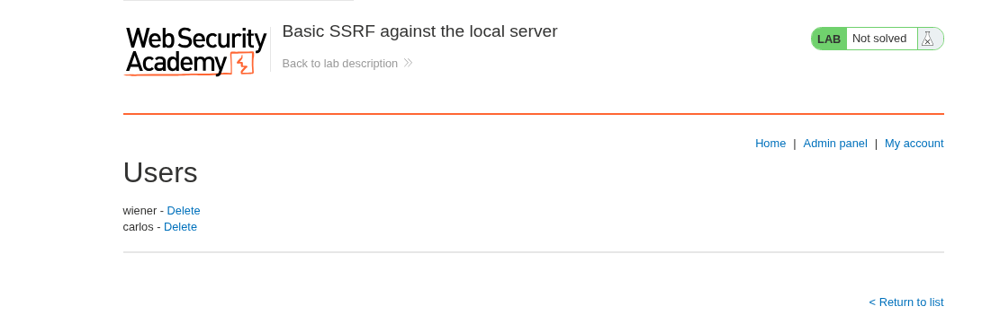
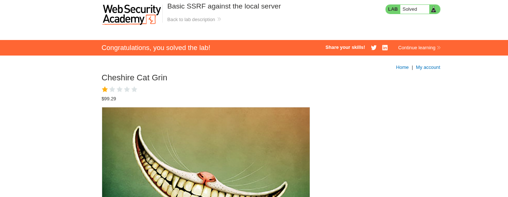

# SSRF - Basic SSRF Against Localhost

## Lab Description

This lab contains a stock check feature that retrieves inventory information from an internal system.

### Objective

Access the administrator interface running on `http://localhost/admin` and delete the user `carlos`.

---

## Reconnaissance

While intercepting the stock check request in Burp Suite, I noticed that the application sends a URL through the `stockApi` parameter.

```http
POST /product/stock HTTP/1.1

stockApi=http://stock.weliketoshop.net:8080/product/stock/check?productId=1
```

Since the server was making a request to the URL supplied in this parameter, it appeared to be a potential SSRF vulnerability.

---

## Exploitation

To verify SSRF, I replaced the original URL with:

```http
http://localhost/admin
```

The response returned the administrator interface, confirming that the server was able to access internal resources on `localhost`.

### Screenshot



---

## Finding the Delete Endpoint

Although the admin panel was accessible, it could not be interacted with directly.

By examining the page source, I discovered a user deletion endpoint:

```http
http://localhost/admin/delete?username=carlos
```

---

## Deleting the User

I modified the `stockApi` parameter again and supplied the deletion endpoint:

```http
stockApi=http://localhost/admin/delete?username=carlos
```

The server issued the request on my behalf and successfully deleted the user `carlos`.

### Screenshot



---

## Impact

This vulnerability allows attackers to force the server to make arbitrary requests to internal systems.

Potential impacts include:

* Accessing internal administrative interfaces
* Internal network reconnaissance
* Accessing cloud metadata services
* Bypassing network restrictions
* Potential privilege escalation

---

## Key Takeaways

* User-controlled URLs should never be fetched without proper validation.
* Internal resources should not be reachable through external user input.
* SSRF can often be chained with other vulnerabilities to gain deeper access into internal networks.

---

## Payloads Used

```http
http://localhost/admin
```

```http
http://localhost/admin/delete?username=carlos
```
