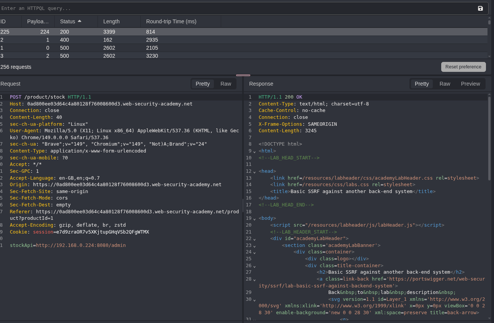
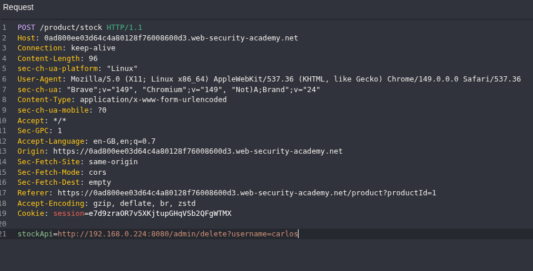

# SSRF - Blind SSRF with Internal Network Scanning

## Lab Description

This lab contains a stock check feature that retrieves information from an internal system.

### Objective

Use the stock check functionality to discover an administrative interface running somewhere in the `192.168.0.X` internal network on port `8080`, then use it to delete the user `carlos`.

---

## Reconnaissance

While testing the stock check functionality, I observed that the application sends requests to a URL supplied through the `stockApi` parameter.

Since the previous lab demonstrated SSRF behavior, I suspected that the application could be used to access internal network resources.

However, unlike the previous challenge, the exact internal IP address hosting the admin panel was unknown.

---

## Internal Network Scanning

To identify the correct host, I used Caido's automation feature to enumerate the internal network range:

```text
192.168.0.1:8080
192.168.0.2:8080
192.168.0.3:8080
...
192.168.0.255:8080
```

Each request was sent through the vulnerable `stockApi` parameter and the responses were analyzed for differences.

After enumerating the range, I discovered an administrative interface hosted on:

```text
http://192.168.0.224:8080/admin
```

### Screenshot



---

## Discovering the Delete Functionality

After accessing the administrator interface, I identified an endpoint responsible for deleting users:

```text
http://192.168.0.224:8080/admin/delete?username=carlos
```

This endpoint could be triggered directly through the SSRF vulnerability.

---

## Exploitation

I intercepted another stock check request and modified the `stockApi` parameter to point to the deletion endpoint:

```http
stockApi=http://192.168.0.224:8080/admin/delete?username=carlos
```

The application issued the request from the server, successfully deleting the user `carlos`.

### Screenshot



---

## Root Cause

The application allowed user-controlled URLs to be fetched by the server without proper validation or filtering.

Because internal IP addresses were not restricted, the SSRF vulnerability could be leveraged to:

* Scan internal networks
* Discover hidden services
* Access administrative interfaces
* Perform privileged actions on internal systems

---

## Impact

An attacker could use SSRF to gain visibility into internal infrastructure that would normally be inaccessible from the internet.

Potential consequences include:

* Internal network reconnaissance
* Discovery of hidden services
* Access to internal administration panels
* Unauthorized actions on trusted internal systems
* Lateral movement within the network

---

## Key Takeaways

* SSRF vulnerabilities can often be used for internal network enumeration.
* Internal administrative services should never rely solely on network location for security.
* Applications should strictly validate outbound requests and restrict access to private IP ranges.

---

## Payloads Used

### Internal Network Enumeration

```text
http://192.168.0.X:8080/admin
```

### User Deletion

```text
http://192.168.0.224:8080/admin/delete?username=carlos
```

